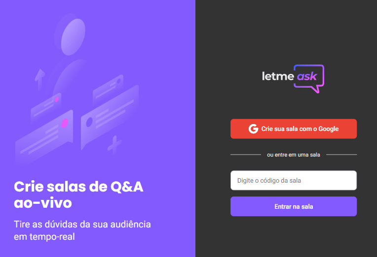

  

<h1 align="center">
    
</h1>

 

## Technologies

Esse projeto foi desenvolvido com as seguintes tecnologias:

-  React
-  Firebase
-  TypeScript

## Project

Desenvolvido durante a **[Next Level Week Together](https://nextlevelweek.com/)** e aprimorado posteriormente, o letMeAsk é um protótipo de perguntas e respostas simples promovendo a interação entre influenciadores e seu publico.